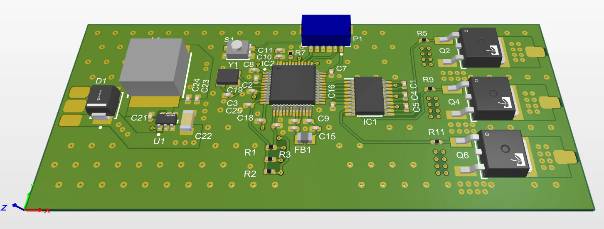
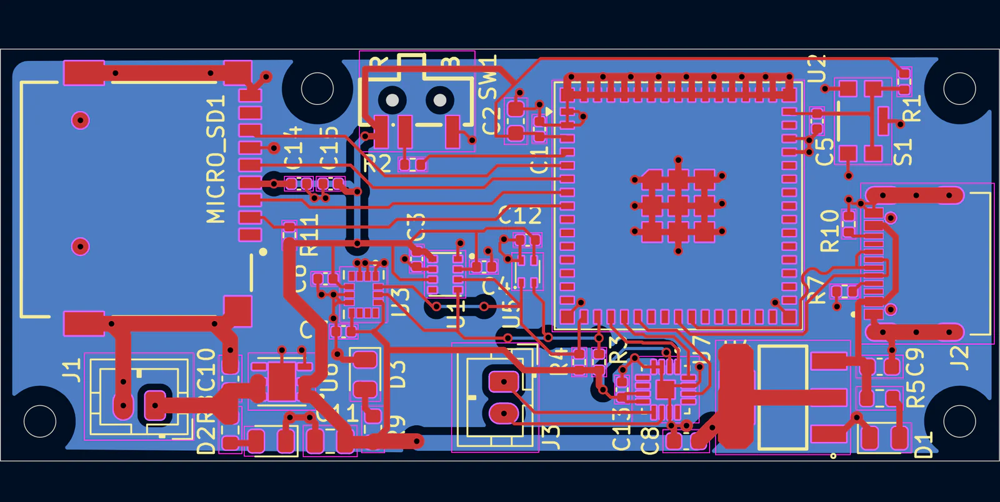

<h1 align="center">Hello World, I'm Barney</h1>

  Third-year MEng Aerospace Engineering student at the University of Sheffield. 
  I love learning about and designing anything that flies, with a particular intrest in PCB and embedded design.

  
  

  
  

### What teams I'm apart of:

- Avionics with **[Seadream Rocketry](https://barneyrye.github.io/personal-website/team/seadream)**, COTS and custom avionics for recovery, logging and flight control on amateur rockets.
- Rep and 3D printing team member at **[iForge](https://barneyrye.github.io/personal-website/team/iforge)**, building the print queue into [`iforge-uos/ignis`](https://github.com/iforge-uos/ignis)
- Combustion chamber team member on **[Solotron](https://barneyrye.github.io/personal-website/team/solotron)**, a hydrogen piston aero-engine project

### Some of my personal projects:

- **[Custom ESC](https://github.com/BarneyRye/WizESC)** - 3 phase electronic speed controller for brushless DC motors.
- **[STM32G4 Devboard](https://github.com/BarneyRye/WizBoard)** - Simple devboard, compatible with standard 2.54mm pitch breadboards, based on the STM32G4CBT6.
- **[Personal Website](https://github.com/BarneyRye/personal-website)** - A static website hosted with GitHub pages to show of my projects [`here`](https://barneyrye.github.io/personal-website/).

### Tools

`C` `STM32` `ESP32` `Arduino` `FreeRTOS` `Altium Designer` `KiCad` `MATLAB` `Simulink` `TypeScript` `React` `Python` `Rust`

